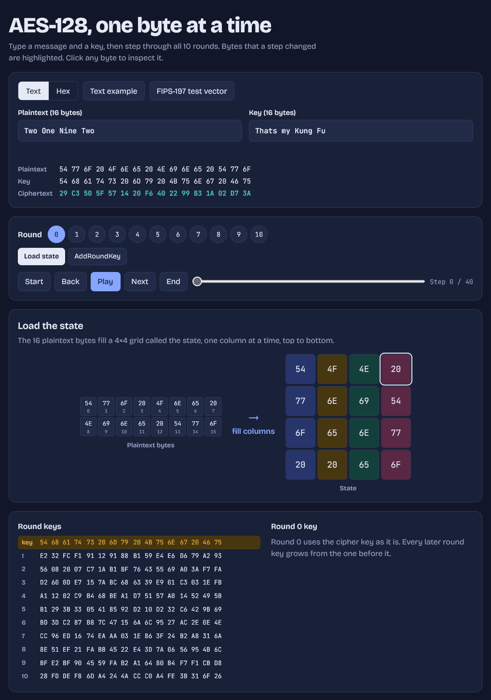

# AES-128 Visualiser

Step-by-step AES-128 encryption in plain HTML, CSS and JavaScript. Enter a plaintext and key, then step through all 10 rounds and watch the state change.

<p align="center">
  
</p>

## Run

Open `index.html` in a browser. No build step or dependencies.

## Files

```
index.html     page markup
css/style.css  styles
js/aes.js      AES-128 core (no DOM)
js/app.js      UI rendering and events
```

## Host on GitHub Pages

Settings → Pages → Deploy from a branch → `main` and `/ (root)`.

Educational use only; not for protecting real data.
